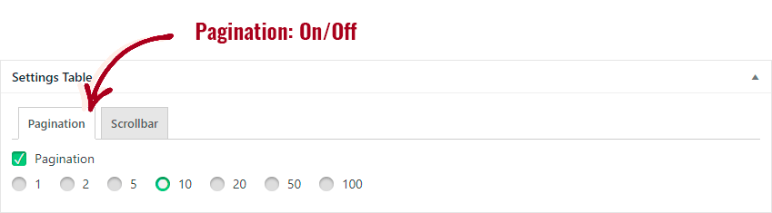
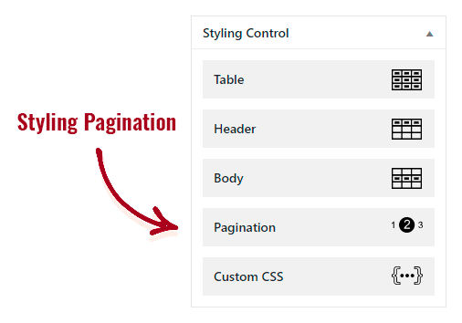

# Пагинации

Чтобы просмотреть доступные шаблоны, а затем установить, выполните следующие действия:

1. В конструкторе «Data Table Ultimate» нажмите кнопку 1, чтобы перейти в режим `Редактора стилей`.

2. Убедитесь, что Вы включили функцию `Пагинация` в метабоксе `Настройка таблицы`.

3. В метабоксе `Управление стилем` нажмите кнопку `Пагинация`.

4. В открывшемся окне стилизации пагинации, нажмите кнопку `Выбрать пагинацию`, чтобы выбрать понравившийся шаблон и установить его.

